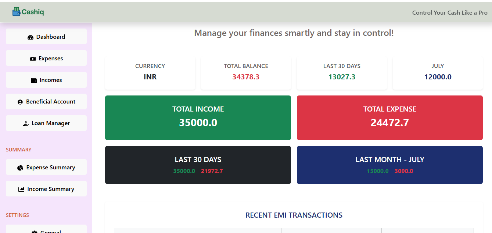
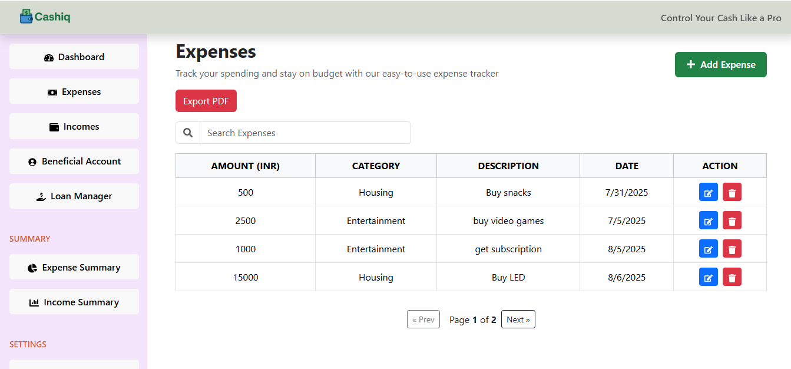
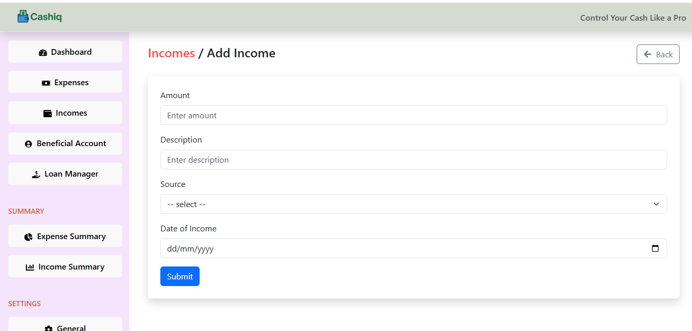
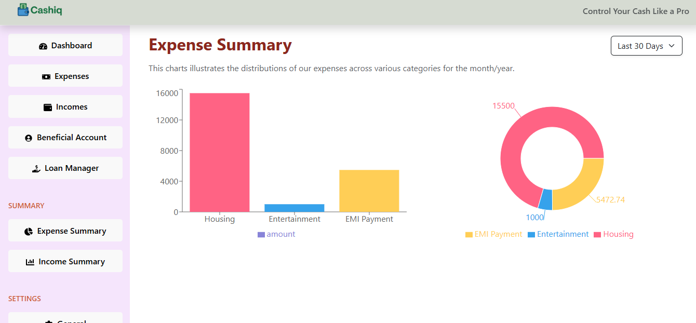
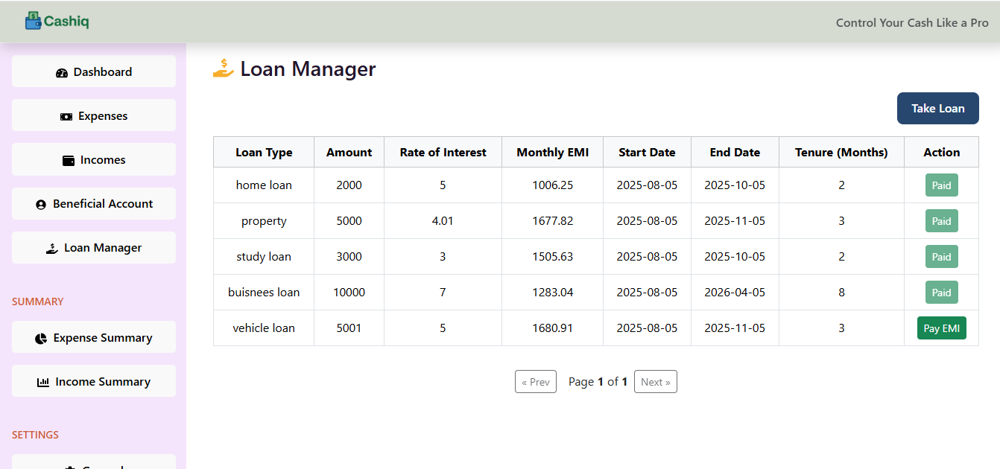
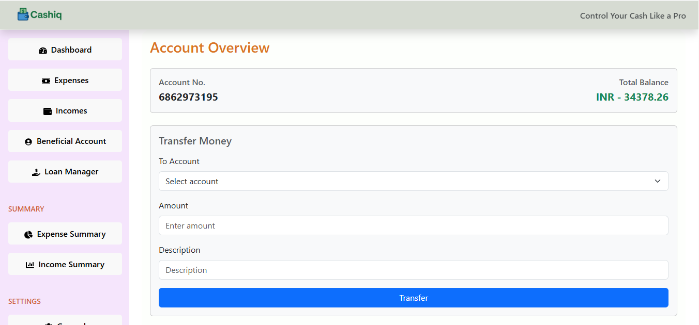

# 💰 Expense Tracker

## 📘 Introduction

The **Expense Tracker** is a web-based application designed to help individuals manage their personal finances by tracking daily expenses in a simple and efficient way.

In today’s fast-paced lifestyle, keeping a manual record of financial transactions is both tedious and error-prone. This application solves that problem by offering a digital, user-friendly solution.

Users can:
- Add, view, edit, and delete expense records.
- View a summary of total spending.
- Gain insights to help with budgeting and saving.

This project is built using **React.js** for the frontend and uses **JSON Server** for data storage. It supports responsive design for different devices.

### 🎯 Target Audience
- Individuals seeking better control over their finances.
- Users who prefer simple tools over complex accounting software.
- Students and young professionals managing limited budgets.

---

## 🎯 Project Objective

The primary objective of the Expense Tracker is to offer a **simple, reliable, and efficient** way to monitor and manage personal expenses.

### 🏆 Main Goals:
- Build a responsive app to **add, view, update, and delete** expenses.
- Show a **real-time summary** of expenses.
- Provide a **clean and intuitive UI**.
- Store and retrieve user data using **JSON + RESTful APIs**.
- (If implemented) Add **user authentication** for personalized management.

### 🛠️ Problems It Solves:
- Manual tracking is **inconvenient and error-prone**.
- Many tools are **too complex** for basic users.
- Users lack awareness of **daily spending**.
- Need for a **centralized, easy-to-use** finance tracking tool.

### ✅ Expected Outcomes:
- Users will track expenses and maintain **financial discipline**.
- Helps identify spending patterns to **budget and save**.
- Lays a foundation for **advanced features** like analytics, budget goals, and report exports.
- Serves as a solid **learning and portfolio project**.

---

## ⚙️ Technology Stack

### 🔹 Frontend
- **React.js** – Core UI library.
- **React Router** – For page navigation.
- **Context API** – Global state management.
- **Axios** – To make API calls.
- **Date-fns** – For date formatting and manipulation.
- **Bootstrap** – UI styling and layout.
- **React Icons** – Icons for UI enhancement.
- **Recharts** – Display data in charts (bar, pie, etc.).

### 🔹 Backend
- **JSON Server** – Fake REST API to store and manage data (db.json).

### 🔹 Database
- **JSON file** – Acts as the primary data store via JSON Server.

---

## 🔧 Features

### ✅ 1. Add Expense  
Add new expense details like title, amount, category, and date using a form.

### ✅ 2. Edit / Delete Expense  
Modify or remove previously entered expenses.

### ✅ 3. View Expense List  
Display all expenses in a user-friendly list format.

### ✅ 4. Calculate Total Expenses  
Show the total spending from all recorded entries.

### ✅ 5. Chart Summary (Income & Expenses)  
Use **Recharts** to display a visual summary of income vs expenses.

### ✅ 6. Beneficiary Account  
Manage details of beneficiaries (useful for recurring transfers).

### ✅ 7. Loan Manager  
Track loans taken/given with repayment and balance status.

### ✅ 8. Filter / Sort Expenses  
(Optional) Filter by category/date or sort by amount/date.

### ✅ 9. Date Handling  
Use **date-fns** for readable and accurate date formatting.

### ✅ 10. Navigation  
Use **React Router** for smooth page transitions.

### ✅ 11. Centralized Data Management  
Use **Context API** to manage state globally across components.

---

## 📦 Installation & Setup

### ✅ 1. Prerequisites
Make sure the following are installed:
- [Node.js](https://nodejs.org/) (v14+)
- npm (comes with Node)
- Git (optional)

---

### ✅ 2. Clone the Repository

```bash
git clone https://github.com/your-username/your-repo-name.git
cd your-repo-name

npm install


npx json-server --watch db.json --port 3001

npm run dev

## Dashboard view 



## Expense Table



## Income Form



## Chart 



## Loan Manager



## Beneficiary Account


